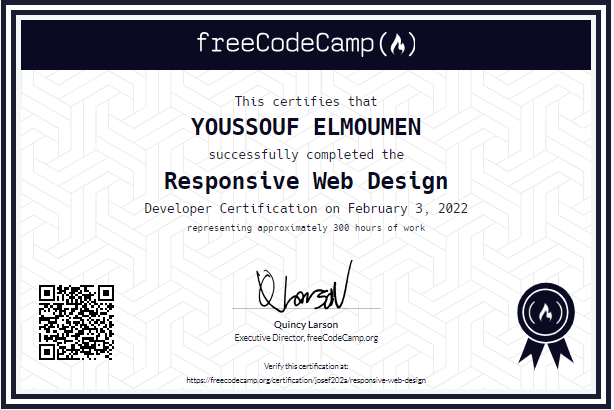
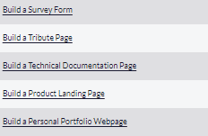

# freeCodeCamp Responsive Web Design Certification

This certifies that **YOUSSOUF ELMOUMEN** has successfully completed the Responsive Web Design Developer Certification on **February 3, 2022,** representing approximately **300 hours** of dedicated work.

## Courses Completed
- Basic HTML and HTML5 (28 Tasks)
- Basic CSS (44 Tasks)
- Applied Visual Design (52 Tasks)
- Applied Accessibility (22 Tasks)
- Responsive Web Design Principles (4 Tasks)
- CSS Flexbox (17 Tasks)
- CSS Grid (22 Tasks)

## Projects
Here you can find the titles of projects I have created to accomplish this learning path and obtain the certification:

1. [Tribute Page](https://codepen.io/you202a/pen/ZEaOJEz)
2. [Survey Form](https://codepen.io/you202a/pen/KKyMvqP)
3. [Product Landing Page]()
4. [Technical Documentation Page](https://codepen.io/you202a/pen/MWOeOEZ)
5. [Personal Portfolio]()
   
   

Thank you, freeCodeCamp, for providing a platform for continuous learning and skill development!
-   [Course Link](https://www.freecodecamp.org/learn/2022/responsive-web-design/)
